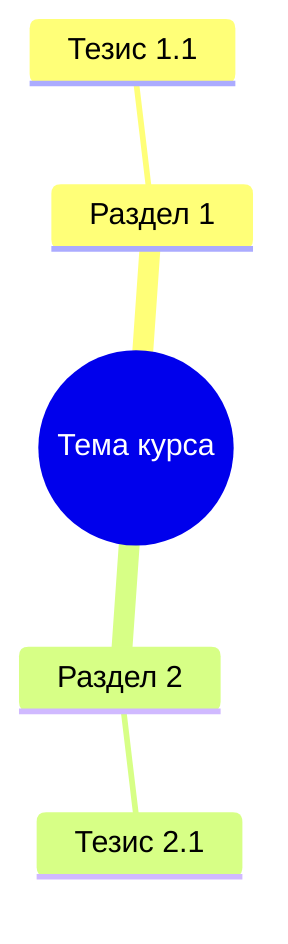

Use this skill when the prompt asks to combine a structured note with a base note.

## Core principle

**The merged document must be MORE detailed than either input alone.** When merging new material into existing base, EXPAND — never compress. The result must be an exhaustive reference that replaces attending all lectures.

## Input expectations

- `Structured markdown` block (new material from transcript).
- `Base note markdown` block (existing accumulated conspect, possibly empty).

## Output contract

- Markdown only — no explanations outside the document.
- Do not wrap output in a code fence.
- Produce a final merged version in Russian.
- **CRITICAL**: ALL facts and details from BOTH inputs must be preserved. Nothing from the base note should be lost or compressed.

## Merge strategy

1. **If Base note is empty**: Use Structured markdown as foundation, keeping full detail.
2. **If Base note has content**: Read each section, EXPAND with new material. NEVER remove or shorten existing text.
3. **Produce a single integrated document** — NOT separate "Лекция 1 / Лекция 2" sections.

## Visual formatting rules

### Mermaid diagrams
Include at least one mermaid diagram:

1. **Mindmap** at start (overview of ALL topics, **max 2 levels of depth**):

2. **Flowchart** for cause-effect chains.
3. **Timeline** for chronological events.

### Callout blocks, Tables, Section separators
Use `> [!NOTE]`, `> [!IMPORTANT]`, `> [!WARNING]`, `> [!TIP]`.
Use tables for comparisons and glossaries.
Use `---` between major sections.

## General rules

- Single integrated conspect — no separate lecture sections.
- EXPAND sections with new material — never compress.
- Preserve ALL facts from BOTH inputs.
- Prefer explicit facts from base note on conflict.
- **NEVER reduce total content volume. Output ≥ base note size.**
