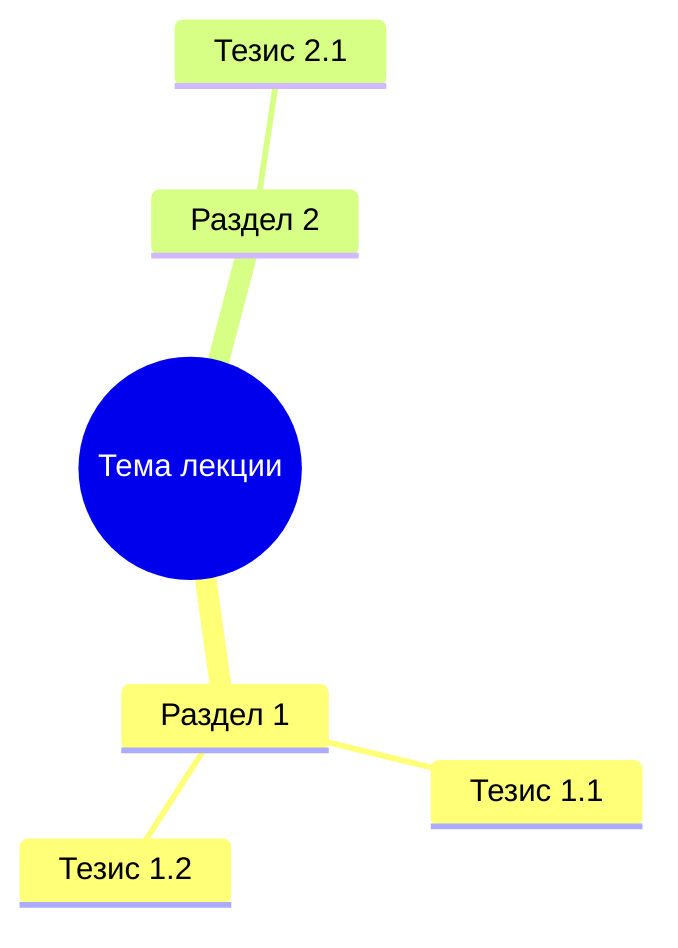
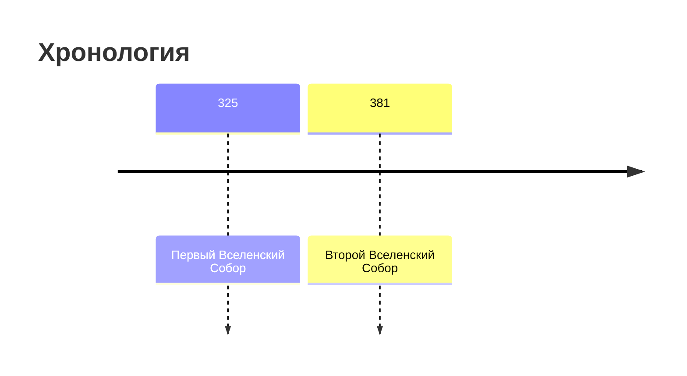

Use this skill when the prompt asks to combine a structured note with a base note.

## Input expectations

- `Structured markdown` block (generated from transcript).
- `Base note markdown` block (possibly empty).

## Output contract

- Markdown only — no explanations outside the document.
- Do not wrap output in a code fence.
- Produce a final merged version in Russian.

## Visual formatting rules

The merged output will be rendered as HTML. Use these features for visual richness:

### Mermaid diagrams
Include at least one mermaid diagram. Wrap in triple-backtick fenced code block with `mermaid` language:

1. **Mindmap** at the start — overview of all lecture topics:

2. **Flowchart** for cause-effect or logical chains:

3. **Timeline** for chronological events (if applicable):

### Callout blocks
Preserve and add `> [!NOTE]`, `> [!IMPORTANT]`, `> [!WARNING]` where appropriate:
- Use `> [!IMPORTANT]` for key exam-worthy conclusions
- Use `> [!NOTE]` for additional context or clarifications
- Use `> [!TIP]` for study recommendations

### Section separators
Place `---` between major content sections.

### Tables
Use tables for structured comparisons, term glossaries, and event summaries.

## General rules

- Preserve facts from both inputs.
- Prefer explicit facts from base note when conflict is unresolved.
- If conflict cannot be resolved, keep both variants and mark uncertainty.
- Keep markdown compatible with standard parsers (headings, lists, quotes, tables, mermaid code blocks).
- If base note is empty, use structured markdown as the foundation.
