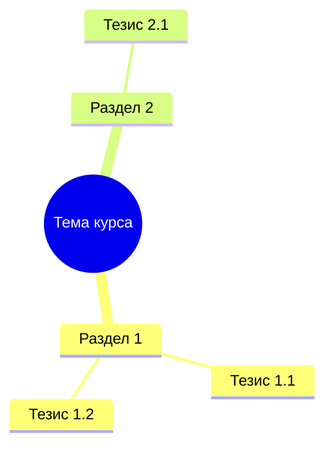
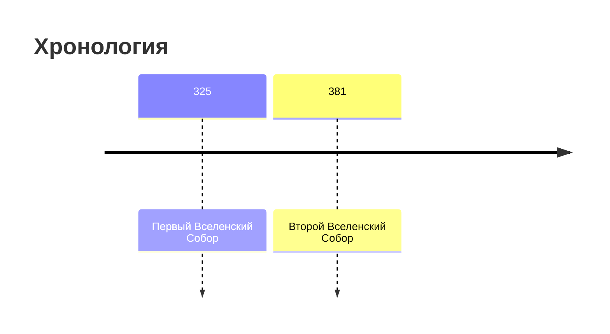

Use this skill when the prompt asks to combine a structured note with a base note.

## Core principle

**The merged document must be MORE detailed and comprehensive than either input alone.** When merging new material into an existing base, EXPAND the base — never compress or summarize existing content. The result must be an exhaustive reference that replaces attending all lectures.

## Input expectations

- `Structured markdown` block (generated from transcript — new material).
- `Base note markdown` block (existing accumulated conspect, possibly empty).

## Output contract

- Markdown only — no explanations outside the document.
- Do not wrap output in a code fence.
- Produce a final merged version in Russian.
- **CRITICAL**: The merged output must contain ALL facts and details from BOTH inputs. Nothing from the base note should be lost or compressed. New material should ADD to the existing content, not replace it.

## Merge strategy

1. **If Base note is empty**: Use Structured markdown as the foundation, keeping full detail.
2. **If Base note has content**:
   - Read each section of the base note.
   - For each section, check if the new material adds information to this topic.
   - If yes — EXPAND the section with new paragraphs, examples, and details from the new material. Do NOT rewrite or compress the existing text.
   - If the new material covers a topic not in the base — ADD a new section.
   - NEVER remove or shorten existing base note content.
3. **Produce a single integrated document** — NOT separate "Лекция 1 / Лекция 2" sections.

## Visual formatting rules

The merged output will be rendered as HTML. Use these features for visual richness:

### Mermaid diagrams
Include at least one mermaid diagram. Wrap in triple-backtick fenced code block with `mermaid` language:

1. **Mindmap** at the start — overview of ALL lecture topics (must update to include topics from ALL merged lectures):

**IMPORTANT**: Keep mindmap to 2 levels of depth maximum (root → section → points). Notion API rejects deeper nesting.

2. **Flowchart** for cause-effect or logical chains:

3. **Timeline** for chronological events (if applicable):

### Callout blocks
Preserve and add `> [!NOTE]`, `> [!IMPORTANT]`, `> [!WARNING]` where appropriate:
- Use `> [!IMPORTANT]` for key exam-worthy conclusions
- Use `> [!NOTE]` for additional context or clarifications
- Use `> [!TIP]` for study recommendations

### Section separators
Place `---` between major content sections.

### Tables
Use tables for structured comparisons, term glossaries, and event summaries.

## General rules

- Produce a single, integrated, continuous conspect — NOT separate "Лекция 1 / Лекция 2" sections with dividers.
- When base note has content, EXPAND sections with new material — never compress.
- Do NOT add metadata (recording_id, source file names, dates) to the output.
- Preserve ALL facts from BOTH inputs. If the base note has 5 paragraphs on a topic and new material adds 3 more points — the result should have AT LEAST 5 paragraphs plus the new content.
- Prefer explicit facts from base note when conflict is unresolved.
- If conflict cannot be resolved, keep both variants and mark uncertainty.
- Keep markdown compatible with standard parsers (headings, lists, quotes, tables, mermaid code blocks).
- **NEVER reduce total content volume. The output should be EQUAL TO OR LARGER than the base note.**
