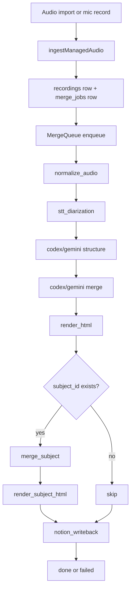

# ABI Conspector — архитектурный анализ проекта

Дата анализа: 2026-02-18
Ветка: `gemini-cli-integration`
Проект: `/Users/mosesvasilenko/abi_conspector`

## 1. Executive summary

Текущее состояние: **рабочий MVP v3+**, где уже реализованы:
- desktop (Electron) pipeline,
- web-режим с аккаунтами и ролями,
- STT роутинг (Groq primary + whisper.cpp fallback),
- abstraction слоя LLM (`codex` / `gemini`),
- Notion writeback,
- subject-based библиотека конспектов,
- `run.sh` для bootstrap / preflight / env wizard.

Проект уже полезен для реальной работы, но в текущем виде есть несколько **архитектурных несогласованностей и race-condition**, которые мешают считать систему production-hardened.

## 2. Что фактически подтверждено

Проверено в этой ревизии:
- `npm test` — **35/35 pass**.
- `npm run smoke:import` — успешно прошел полный пайплайн до `done` и артефактов `merged.md` + `html`.
- `./run.sh --preflight-strict` — валидно ловит блокеры окружения (Groq key/whisper.cpp bin/model).

Это означает, что базовый контур работает, а диагностика окружения в целом полезная.

## 3. Архитектура (по слоям)

## 3.1 Клиентские интерфейсы
- Desktop UI (Electron renderer):
  - `/Users/mosesvasilenko/abi_conspector/src/renderer/index.html`
  - `/Users/mosesvasilenko/abi_conspector/src/renderer/app.js`
- Web UI (browser SPA):
  - `/Users/mosesvasilenko/abi_conspector/web/public/index.html`
  - `/Users/mosesvasilenko/abi_conspector/web/public/app.js`

## 3.2 Оркестрация и pipeline
- Точка входа Desktop:
  - `/Users/mosesvasilenko/abi_conspector/src/main/index.js`
- Очередь:
  - `/Users/mosesvasilenko/abi_conspector/src/main/pipeline/mergeQueue.js`
- Пайплайн стадий:
  - `/Users/mosesvasilenko/abi_conspector/src/main/pipeline/mergePipeline.js`

Стадии pipeline:
1. `normalize_audio`
2. `stt_diarization`
3. `codex_structure` (или Gemini)
4. `merge` (или Gemini)
5. `render_html`
6. `merge_subject` (если есть `subject_id`)
7. `render_subject_html` (если есть `subject_id`)
8. `notion_writeback` (soft-fail по настройке)

## 3.3 Хранилище
- SQLite (основная БД):
  - `/Users/mosesvasilenko/abi_conspector/src/main/db/database.js`
- Таблицы:
  - `recordings`
  - `merge_jobs`
  - `subjects`
- Web auth БД (`web.db`) в `web/server.js`:
  - `users`
  - `sessions`

## 3.4 STT подсистема
- Роутер и fallback chain:
  - `/Users/mosesvasilenko/abi_conspector/src/main/workers/sttWorker.js`
- Провайдеры:
  - Groq chunked: `/Users/mosesvasilenko/abi_conspector/src/main/workers/sttGroqChunkedWorker.js`
  - whisper.cpp: `/Users/mosesvasilenko/abi_conspector/src/main/workers/sttWhisperCppWorker.js`
  - AssemblyAI: `/Users/mosesvasilenko/abi_conspector/src/main/workers/sttAssemblyAiWorker.js`
  - Deepgram: `/Users/mosesvasilenko/abi_conspector/src/main/workers/sttDeepgramWorker.js`

## 3.5 LLM абстракция
- Provider switch:
  - `/Users/mosesvasilenko/abi_conspector/src/main/workers/llmProvider.js`
- Codex worker:
  - `/Users/mosesvasilenko/abi_conspector/src/main/workers/codexWorker.js`
- Gemini worker:
  - `/Users/mosesvasilenko/abi_conspector/src/main/workers/geminiWorker.js`

## 3.6 Notion интеграция
- Worker:
  - `/Users/mosesvasilenko/abi_conspector/src/main/workers/notionWorker.js`

Реализовано:
- page resolve по `pageId`/`pageTitle`/`rootPageId`,
- nested pages scan,
- merge with existing page content,
- backup и notion-лог,
- markdown ↔ notion blocks.

## 3.7 Web backend
- `/Users/mosesvasilenko/abi_conspector/web/server.js`

Функции:
- auth/register/login/logout,
- роли `admin`/`user`,
- upload и запуск pipeline,
- subject CRUD,
- subject library (html/md),
- admin notion writeback,
- admin git sync/apply.

## 3.8 Ops/Bootstrap
- Launcher:
  - `/Users/mosesvasilenko/abi_conspector/run.sh`
- Bootstrap deps:
  - `/Users/mosesvasilenko/abi_conspector/scripts/bootstrap.sh`
- Preflight:
  - `/Users/mosesvasilenko/abi_conspector/scripts/preflight.js`
- Env diagnostics:
  - `/Users/mosesvasilenko/abi_conspector/scripts/env-doctor.js`
- Gemini skills setup:
  - `/Users/mosesvasilenko/abi_conspector/scripts/setup-gemini-skills.sh`

## 4. Причинно-следственная логика исполнения

Ключевая идея: пайплайн один для desktop и web, а UI/transport разный.

## 5. Сильные стороны реализации

1. Четкое разделение на workers (STT/LLM/Notion/HTML) и pipeline orchestration.
2. Есть ControlledError-подход для предсказуемых ошибок.
3. Хороший набор smoke/unit тестов для ядра.
4. Режимы устойчивости и fallback-политики контролируются env.
5. `run.sh` реально закрывает боль “ручной setup на Ubuntu”.
6. LLM abstraction уже готова под Codex/Gemini без рефакторинга pipeline.

## 6. Критические несогласованности и риски

## P0 (исправлять в первую очередь)

1. `run.sh` удаляет часть актуальных переменных STT v3 при `--setup-all`.
- Где: `cleanup_legacy_env_vars` в `/Users/mosesvasilenko/abi_conspector/run.sh`.
- Симптом: удаляются `ASSEMBLYAI_API_KEY`, `DEEPGRAM_API_KEY`, `CONSPECTOR_DEEPGRAM_MODEL`, `CONSPECTOR_STT_FALLBACK_CHAIN`, хотя wizard их записывает.
- Эффект: fallback chain деградирует после полного setup.

2. Race-condition назначения `subject_id` в web upload.
- Где: `/Users/mosesvasilenko/abi_conspector/web/server.js`.
- Сейчас: `ingestManagedAudio()` enqueue делает сразу, а `subject_id` пишется после этого (`updateRecordingSubject`).
- Эффект: `merge_subject`/`render_subject_html` могут пропуститься при быстрой обработке.

3. Политика Notion “fail with suggestions” нарушена auto-create страниц.
- Где: `resolvePageId()` в `/Users/mosesvasilenko/abi_conspector/src/main/workers/notionWorker.js`.
- Сейчас: если title не найден под root, код пытается `client.pages.create(...)`.
- Эффект: расхождение с зафиксированным бизнес-правилом, риск создания лишних страниц.

4. Несогласованность `managedPaths` для subject в desktop.
- Где:
  - `mergePipeline` использует `managedPaths.subjects`.
  - `getManagedPaths()` в `/Users/mosesvasilenko/abi_conspector/src/main/config.js` не содержит `subjects`.
- Эффект: latent bug для desktop-сценариев с `subject_id`.

## P1

5. Preflight всегда проверяет `codex`, даже если активен `CONSPECTOR_LLM_PROVIDER=gemini`.
- Где: `/Users/mosesvasilenko/abi_conspector/scripts/preflight.js`.
- Эффект: ложные блокеры при Gemini-only deployment.

6. Web runtime config не использует часть STT v3 расширений.
- Где: runtime config в `/Users/mosesvasilenko/abi_conspector/web/server.js`.
- Сейчас: отсутствуют `fallbackChain`, `assemblyaiApiKey`, `deepgramApiKey` в runtimeConfig.stt.
- Эффект: фактическое поведение web отличается от desktop и env wizard.

7. `/api/upload` отдает `jobId`, который фактически не job id.
- Где: `/Users/mosesvasilenko/abi_conspector/web/server.js`.
- Сейчас: `jobId: result.normalizationStatus === 'queued' ? result.recordingId : null`.
- Эффект: API контракт вводит в заблуждение.

8. Разные дефолты Groq модели между слоями.
- `config.js`: `whisper-large-v3`
- `web/server.js`: `whisper-large-v3-turbo`
- Эффект: неочевидная смена качества/скорости между desktop и web.

## P2

9. В web UI остаются `prompt()/confirm()` для некоторых действий (создание предмета, git commit message).
- Где: `/Users/mosesvasilenko/abi_conspector/web/public/app.js`.
- Эффект: UX неунифицирован, хуже автоматизация/валидируемость.

10. Нет rate limiting / anti-bruteforce на auth endpoints.
- Где: `/Users/mosesvasilenko/abi_conspector/web/server.js`.
- Эффект: security-долг для публичного деплоя.

## 7. Тестовое покрытие: что покрыто и что нет

Покрыто:
- db schema/migrations,
- queue semantics,
- import logic,
- ffmpeg args,
- LLM args/provider mapping,
- Notion markdown mapping helpers,
- resilience fallback happy-path,
- web auth + роль + базовые endpoints.

Недопокрыто:
1. Интеграционные тесты subject-пайплайна (`merge_subject`, `render_subject_html`).
2. Notion integration e2e (включая nested lookup + suggestions + merge-with-existing).
3. STT engines e2e (Groq chunking, whispercpp execution, Deepgram/AssemblyAI chain).
4. `run.sh` regression tests для `--setup-all`, `--configure-env`, `--fix-env-paths`.
5. UI e2e для desktop (IPC flow + progress + кнопки действий).

## 8. Архитектурная оценка

Общая оценка: **8/10 для MVP**, **5.5/10 для production readiness**.

Почему:
- Архитектура уже модульная и расширяемая,
- но есть несколько системных несогласованностей между wizard/env/preflight/runtime,
- и есть критические точки, где возможен “тихий” неправильный результат (subject race, auto-create page).

## 9. Рекомендуемый план стабилизации

## Шаг 1 (быстрые фиксы, 1 день)
1. Синхронизировать whitelist переменных в `run.sh`.
2. Убрать race: назначать `subject_id` до enqueue (или расширить ingest API).
3. Добавить `subjects` в `getManagedPaths()`.
4. Вернуть Notion поведение к “fail with suggestions, no autocreate”.

## Шаг 2 (2-3 дня)
1. Унифицировать runtimeConfig для desktop/web (единый builder).
2. Исправить preflight под `CONSPECTOR_LLM_PROVIDER`.
3. Исправить `/api/upload` контракт (`jobId` реальный либо убрать поле).
4. Добавить integration tests для subject/notion/stt-chain.

## Шаг 3 (production hardening)
1. Добавить rate limiting + базовый audit log для auth/admin routes.
2. Добавить systemd unit + healthcheck + restart policy docs.
3. Добавить e2e smoke для web UI потока “upload -> done -> notion”.

## 10. Заключение

Проект уже далеко ушел от “прототипа с заглушками”: ядро рабочее, модульность правильная, и функциональность соответствует целевому сценарию (аудио -> транскрипт -> структурирование -> merge -> HTML/Notion).

Основной приоритет сейчас не в новых фичах, а в **сведении runtime-контуров к единому, предсказуемому поведению** и устранении нескольких критичных несоответствий между бизнес-правилами и фактическим кодом.
