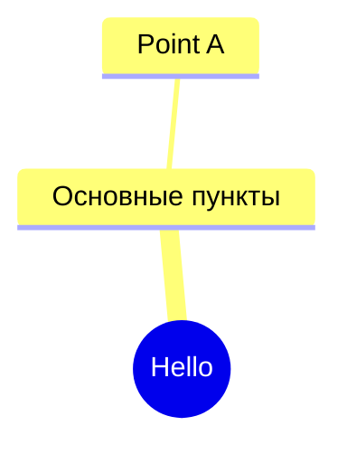
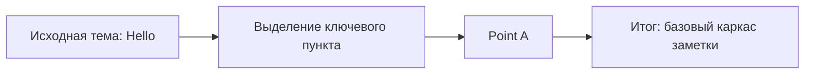

# Hello

> [!IMPORTANT]
> Ключевой тезис: в материале явно указан только один пункт — **Point A**.

---

## Основное содержание

- Point A

---

## Краткая сводка

| Раздел | Содержание |
|---|---|
| Тема | Hello |
| Главный пункт | Point A |
| Статус базы | Base markdown отсутствует (`none`) |

> [!NOTE]
> Базовая заметка не предоставлена, поэтому итог построен полностью на Structured markdown.

> [!TIP]
> Для расширения конспекта добавьте определения, примеры и связи между пунктами.